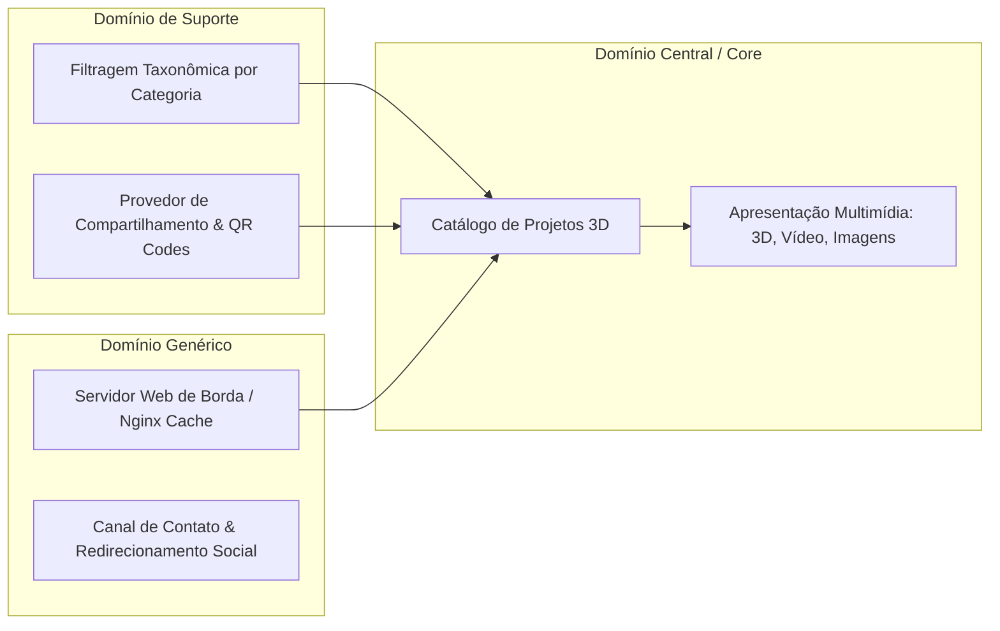

# 03. Decomposição em Domínios

A arquitetura lógica do portfólio organiza-se em domínios essenciais voltados à apresentação e conversão profissional:

* **Catálogo de Projetos (Core):** Representação dos modelos autorais, dados de autoria, atribuições de conceito e assets vinculados.
* **Apresentação Multimídia (Core):** Orquestração de carrosséis, reprodutores de vídeo responsivos e iframes WebGL dark-themed.
* **Taxonomia e Filtros (Supporting):** Mecanismo declarativo de filtragem via classes de estilo (`CHA_REAL`, `CHA_STY`, `PRO_REAL`, `PRO_STY`).\n