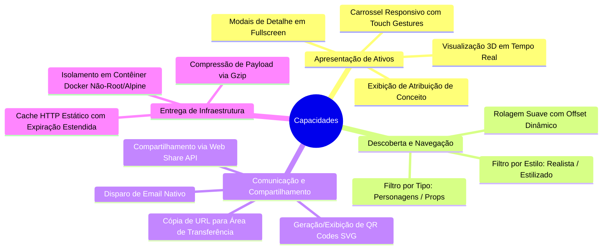

# 04. Capacidades do Sistema

```mermaid
mindmap
  root((Capacidades))
    Apresentação de Ativos
      Visualização 3D em Tempo Real
      Carrossel Responsivo com Touch Gestures
      Modais de Detalhe em Fullscreen
      Exibição de Atribuição de Conceito
    Descoberta e Navegação
      Filtro por Tipo: Personagens / Props
      Filtro por Estilo: Realista / Estilizado
      Rolagem Suave com Offset Dinâmico
    Comunicação e Compartilhamento
      Disparo de Email Nativo
      Compartilhamento via Web Share API
      Cópia de URL para Área de Transferência
      Geração/Exibição de QR Codes SVG
    Entrega de Infraestrutura
      Compressão de Payload via Gzip
      Cache HTTP Estático com Expiração Estendida
      Isolamento em Contêiner Docker Não-Root/Alpine
```