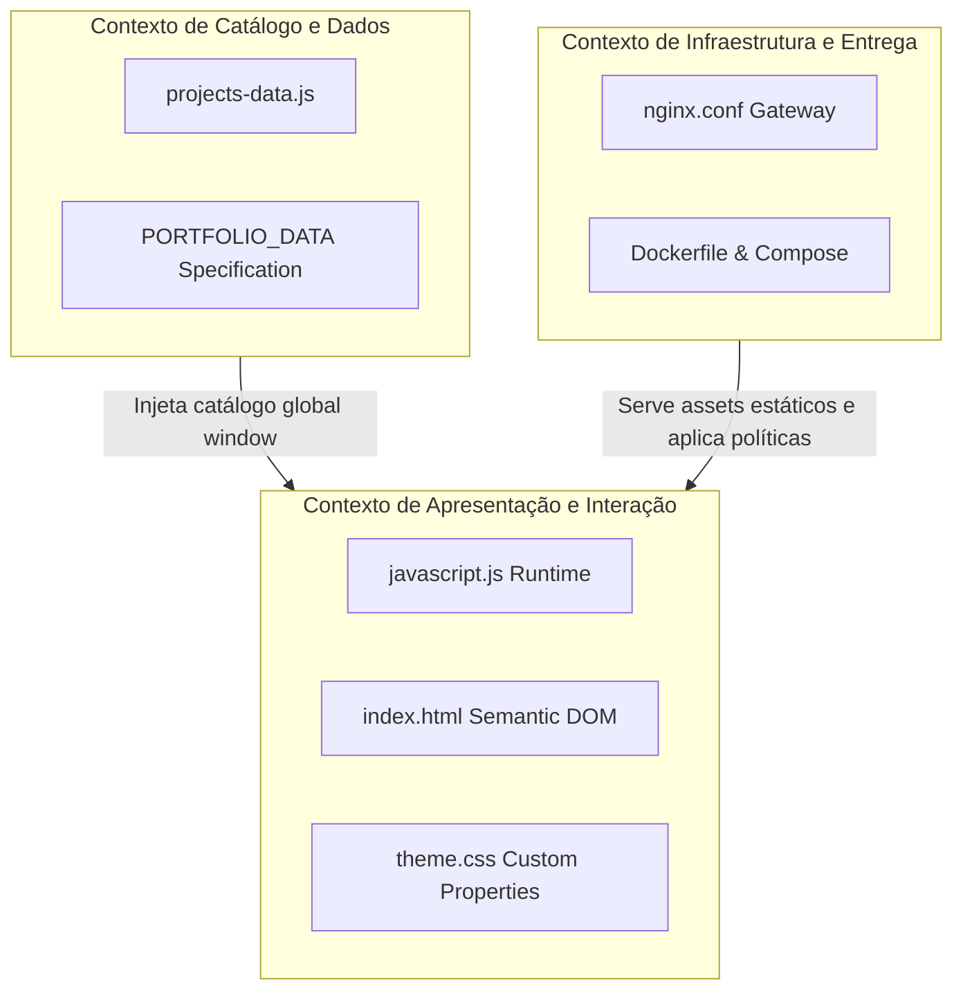

# 05. Bounded Contexts

O isolamento contextual é mantido na fronteira de dados estáticos e apresentação:

### Contratos de Fronteira:
* **Entrada de Dados:** `window.PORTFOLIO_DATA` atua como contrato formal estuturado de leitura desacoplado da renderização.
* **Saída para o DOM:** O runtime `javascript.js` compila templates literais e injeta nós nos seletores `#gallery-items-container` e `#gallery-modals-outlet`.\n