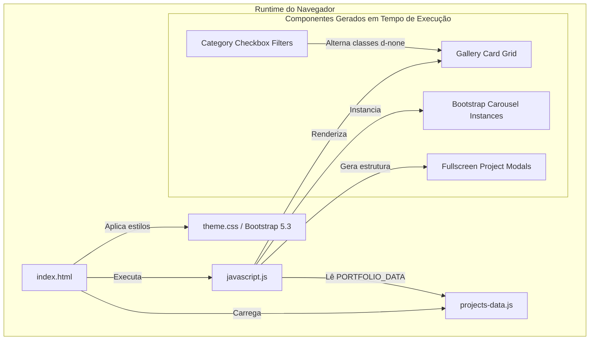

# 06. Visão de Componentes (C4 Nível 3)

Decomposição dos blocos de execução no frontend:

```mermaid
flowchart TD
    subgraph BrowserRuntime[Runtime do Navegador]
        Index[index.html]
        DataStore[projects-data.js]
        Controller[javascript.js]
        Styles[theme.css / Bootstrap 5.3]

        subgraph DynamicComponents[Componentes Gerados em Tempo de Execução]
            GalleryCards[Gallery Card Grid]
            CarouselComp[Bootstrap Carousel Instances]
            ModalComp[Fullscreen Project Modals]
            Filters[Category Checkbox Filters]
        end
    end

    Index -->|Carrega| DataStore
    Index -->|Executa| Controller
    Index -->|Aplica estilos| Styles
    Controller -->|Lê PORTFOLIO_DATA| DataStore
    Controller -->|Renderiza| GalleryCards
    Controller -->|Instancia| CarouselComp
    Controller -->|Gera estrutura| ModalComp
    Filters -->|Alterna classes d-none| GalleryCards
```