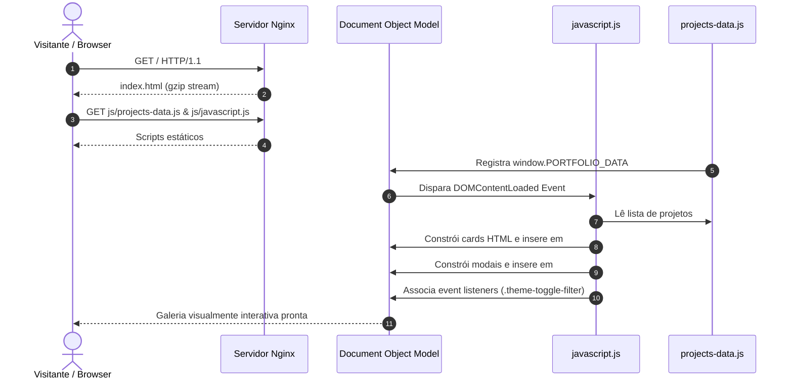
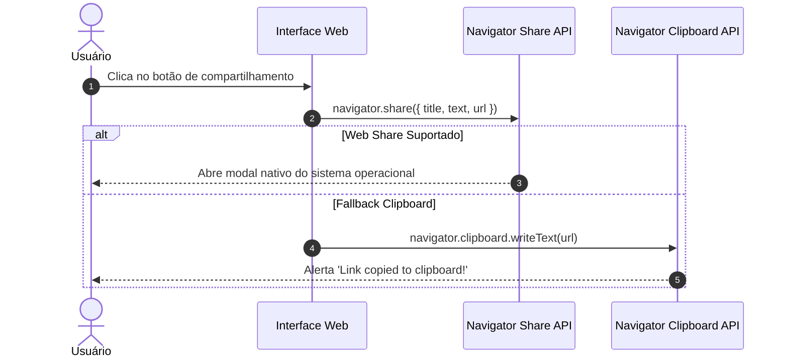

# 07. Fluxos de Execução

## 7.1 Fluxo de Inicialização e Hidratação Dinâmica

```mermaid
sequenceDiagram
    autonumber
    actor User as Visitante / Browser
    participant Nginx as Servidor Nginx
    participant DOM as Document Object Model
    participant JS as javascript.js
    participant Data as projects-data.js

    User->>Nginx: GET / HTTP/1.1
    Nginx-->>User: index.html (gzip stream)
    User->>Nginx: GET js/projects-data.js & js/javascript.js
    Nginx-->>User: Scripts estáticos
    Data->>DOM: Registra window.PORTFOLIO_DATA
    DOM->>JS: Dispara DOMContentLoaded Event
    JS->>Data: Lê lista de projetos
    JS->>DOM: Constrói cards HTML e insere em #gallery-items-container
    JS->>DOM: Constrói modais e insere em #gallery-modals-outlet
    JS->>DOM: Associa event listeners (.theme-toggle-filter)
    DOM-->>User: Galeria visualmente interativa pronta
```

## 7.2 Fluxo de Compartilhamento Seguro

```mermaid
sequenceDiagram
    autonumber
    actor User as Usuário
    participant UI as Interface Web
    participant ShareAPI as Navigator Share API
    participant ClipAPI as Navigator Clipboard API

    User->>UI: Clica no botão de compartilhamento
    UI->>ShareAPI: navigator.share({ title, text, url })
    alt Web Share Suportado
        ShareAPI-->>User: Abre modal nativo do sistema operacional
    else Fallback Clipboard
        UI->>ClipAPI: navigator.clipboard.writeText(url)
        ClipAPI-->>User: Alerta 'Link copied to clipboard!'
    end
```