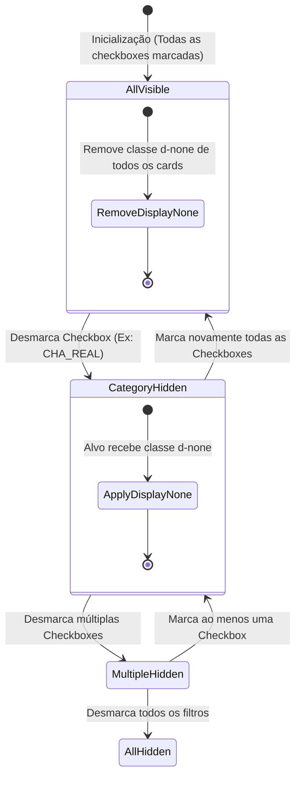

# 09. Máquina de Estados dos Filtros

```mermaid
stateDiagram-v2
    [*] --> AllVisible: Inicialização (Todas as checkboxes marcadas)

    AllVisible --> CategoryHidden: Desmarca Checkbox (Ex: CHA_REAL)
    CategoryHidden --> AllVisible: Marca novamente todas as Checkboxes
    CategoryHidden --> MultipleHidden: Desmarca múltiplas Checkboxes
    MultipleHidden --> CategoryHidden: Marca ao menos uma Checkbox
    MultipleHidden --> AllHidden: Desmarca todos os filtros

    state CategoryHidden {
        [*] --> ApplyDisplayNone: Alvo recebe classe d-none
        ApplyDisplayNone --> [*]
    }

    state AllVisible {
        [*] --> RemoveDisplayNone: Remove classe d-none de todos os cards
        RemoveDisplayNone --> [*]
    }
```