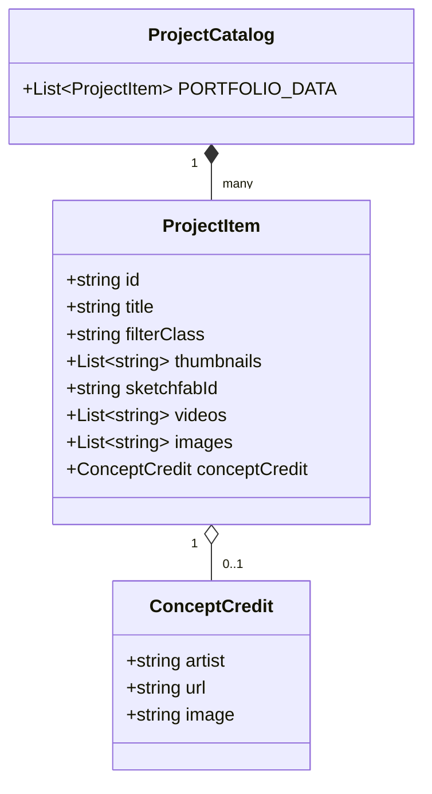

# 10. Modelo Conceitual e Contratos de Dados

O schema do catálogo mantido em `projects-data.js` obedece à seguinte estrutura conceitual:

### Validação dos Tipos:
* `id` (*string, obrigatório*): Identificador único slugificado (ex: `proj-001`).
* `title` (*string, obrigatório*): Título visível na galeria e no modal.
* `filterClass` (*enum string, obrigatório*): `CHA_REAL` | `CHA_STY` | `PRO_REAL` | `PRO_STY`.
* `thumbnails` (*array de URLs, obrigatório*): Imagens para exibição no carrossel de capa.
* `sketchfabId` (*string, opcional*): Hash do modelo no Sketchfab para carregamento em WebGL.
* `videos` (*array de URLs, opcional*): Mídias em formato MP4.
* `images` (*array de URLs, opcional*): Renders detalhados e peças de apresentação.
* `conceptCredit` (*object, opcional*): Objeto de crédito para artistas conceituais 2D.\n