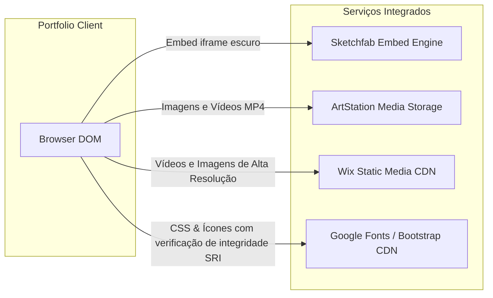

# 13. Integrações de Terceiros

* **Sketchfab:** Provedor de renderização de malhas 3D em tempo real com controle dinâmico de UI (`ui_theme=dark`).
* **ArtStation CDN / Wix Media:** Provedores de hospedagem descentralizada para arquivos de mídia pesada (vídeos 1080p e renders 4K).