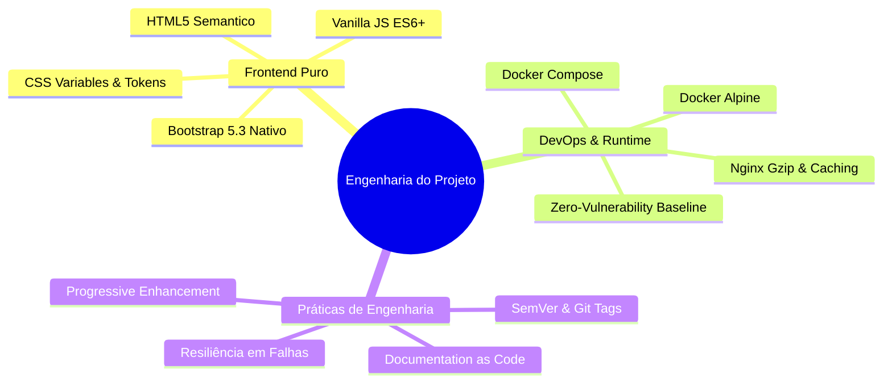

Este documento sintetiza para recrutadores, diretores de tecnologia (Tech Leads) e avaliadores de engenharia o conjunto de competências, padrões aplicados e disciplinas de entrega implementadas neste ecossistema.

## 1. Stack & Frameworks (Hard Skills)
* **Linguagens:** JavaScript (ES6+ Vanilla, sem dependências de compilação ou bundlers obrigatórios), HTML5 Semântico, CSS3 (com Custom Properties / Design Tokens).
* **Framework de Estilo:** Bootstrap 5.3.3 (utilizado via abordagem utilitária nativa, sem dependência de jQuery ou wrappers legados) e Bootstrap Icons 1.11.3.
* **Servidor Web & Borda:** Nginx (base Alpine Linux), configurado com compressão Gzip (`gzip_min_length 1024`, tipos texto, js, css, svg) e cabeçalhos de controle de cache agressivo (`expires 30d`, `Cache-Control: public, no-transform`).
* **Conteinerização & DevOps:** Docker (`Dockerfile` multi-stage com `nginx:alpine-slim`), Docker Compose (`docker-compose.yml` com mapeamento read-only para segurança em execução local).
* **Mídias & Formatos Especializados:** WebP, SVG nativo, MP4 H.264 para streaming contínuo e embeds WebGL com Sketchfab 3D.

## 2. Conceitos & Paradigmas de Desenvolvimento
* **Decoupled Data-Driven View:** Separação estrita entre os dados declarativos do portfólio (`projects-data.js`) e a camada de renderização DOM (`javascript.js`), permitindo manutenção de conteúdo sem alteração estrutural no markup.
* **Zero Dependency Runtime:** Arquitetura orientada a manter o runtime leve, rápido e imune a quebras de bibliotecas de terceiros (eliminação sistemática de jQuery e plugins obsoletos).
* **Engenharia de Interface & Resiliência:**
  * Tratamento de layout shifts utilizando contêineres dimensionados (`ratio ratio-16x9`).
  * Fallbacks progressivos para APIs nativas do navegador (Web Share API com fallback para Clipboard API, e fallback final para visualização de QR Code modal).
* **Performance & Otimização:**
  * Carregamento sob demanda (`loading="lazy"`) em imagens de alta resolução.
  * Estratégia de assets externos descarregados em CDN especializada para economizar largura de banda do host principal.
* **Segurança de Execução:** Mapeamento de contêiner com volumes estritamente como somente leitura (`:ro`), mitigação de vulnerabilidades de navegação externa com `rel="noopener noreferrer"`.

## 3. Versionamento, Git Tags & Workflow
* **Conventional Commits:** Adoção de convenções semânticas para mensagens de commit (`feat:`, `fix:`, `docs:`, `chore:`, `perf:`), viabilizando rastreabilidade clara de mudanças.
* **Git Tags & Semantic Versioning (SemVer):** Utilização de tags Git no formato `vMAJOR.MINOR.PATCH` para marcos de entrega estáveis (ex: `v1.0.0` para estabilização de migração, `v1.1.0` para suíte de documentação viva).
* **Branching Strategy:** Fluxo estruturado baseado em branches de funcionalidade (`feature/`), correções pontuais (`fix/`) e consolidação via Pull Requests com revisão técnica prévia.

## 4. Soft Skills & Capacidades de Engenharia Demonstradas
* **Visão Sistêmica de Longo Prazo:** Decisão consciente por arquitetura simplificada (KISS) para garantir que o projeto funcione intacto por 10+ anos sem quebra de ecossistema node/npm.
* **Pensamento Crítico para Trade-offs:** Avaliação de prós e contras entre construir uma Single Page Application complexa (React/Vue/Angular) versus adotar arquitetura estática pura de alta performance.
* **Disciplina de Documentação:** Capacidade de traduzir a implementação de código em documentação técnica estruturada (Documentation as Code) acessível tanto a executivos quanto a engenheiros.
* **Foco na Experiência do Usuário (UX/DX):** Criação de interfaces responsivas para diretores de arte e recrutadores, combinada com facilidade para o desenvolvedor manter o catálogo de ativos.

## 5. Mapa Mental de Competências Aplicadas
